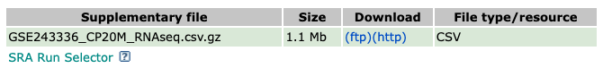
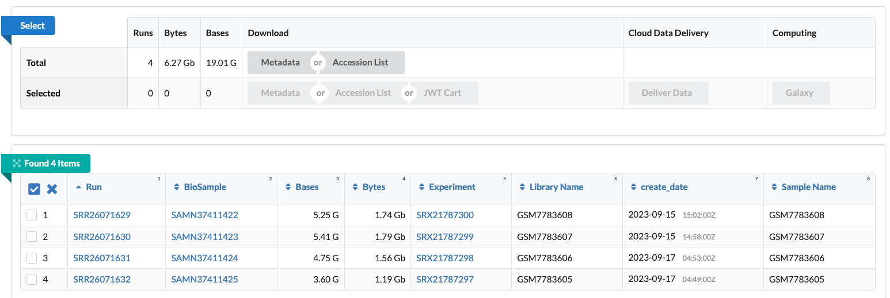
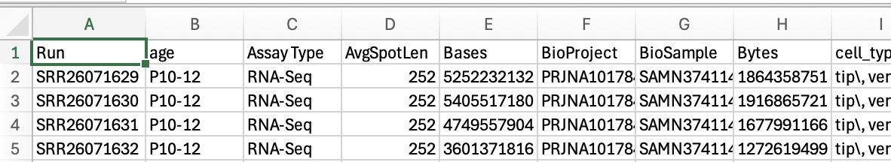

# download_GSE

This pipeline is designed to automate downloading public datasets from NIH
[Gene Expression Omnibus (GEO)](https://www.ncbi.nlm.nih.gov/geo/) using 
[Snakemake](https://snakemake.readthedocs.io/en/stable/). We will use 
[GSE243336](https://www.ncbi.nlm.nih.gov/geo/query/acc.cgi?acc=GSE243336)
for a demonstration.

## Sampletable

We use a sampletable (`sampletable.csv`) consisting of columns for `samplename`
and `SRR` IDs, and rows for samples. Prepare this file as a comma-separated 
format.

```bash
$ cat sampletable.csv
samplename,SRR
duct2,SRR26071629
duct1,SRR26071630
tip2,SRR26071631
tip1,SRR26071632
```

If you are unfamiliar with figuring out the SRR IDs, click the _SRA Run Selector_
in the bottom of the 
[GSE243336](https://www.ncbi.nlm.nih.gov/geo/query/acc.cgi?acc=GSE243336):



The SRR IDs are provided through the table below or the _Metadata_ button 
in the _Select_ section:



The _Metadata_ buttom enables users to download `csv` file containing metadata,
including the SRR IDs.




## Installing packages

We use [Conda](https://docs.conda.io/en/latest/) to manage package installation.
Configure the following three packages in `env.yaml` file, as shown below:

```bash
$ cat env.yaml
sra-tools
snakemake<8
pandas
```

The [`sra-tools`](https://github.com/ncbi/sra-tools) package can be downloaded
without Conda here: 
[NCBI SRA Toolkit](https://github.com/ncbi/sra-tools/wiki/01.-Downloading-SRA-Toolkit)

## Running Snakemake

Execute the following commands to run Snakemake. The `-j` parameter is used
to specify the number of cores. Suppose you are using 8 cores.

```bash
# Dryrun
$ snakemake -n 

# Run
$ snakemake -j 8
```

Optionally, you can generate an image file to visualize the directed acyclic 
graph (DAG).

```bash
$ snakemake --dag | dot -Tpng > dag.png
```


## Output files

Upon successful completion, this Snakemake pipeline generates the following 
output files in the `fastq` directory:

```bash

```
